# BRD Hệ thống quản lý Vendor - Cas Console

**TÀI LIỆU ĐẶC TẢ YÊU CẦU NGHIỆP VỤ (BRD)**

**HỆ THỐNG ĐIỀU HÀNH & KẾT NỐI OPEN BANKING - CAS CONSOLE**

| **Thuộc tính** | **Chi tiết** |
|---|---|
| **Sản phẩm** | **Cas Console** |
| **Mã tài liệu** | **BRD-CAS-CONSOLE-2026-V3** |
| **Phiên bản** | **3.0.0 (UI New Generation - Brand Theme Green)** |
| **Trạng thái** | **Đã phê duyệt (Approved & Live)** |
| **Ngày cập nhật** | **20/08/2026** |
| **Tác giả** | **Business Architecture & Analyst Team** |

---

## 1. MỤC TIÊU TÀI LIỆU & MỤC LỤC

1. **Tổng quan Hệ thống & Kiến trúc Vận hành**
2. **Phân hệ 1: Tổng quan (Overview & Tháp điều hành)**
   - 2.1 Tài liệu và giới thiệu nền tảng Cas SDK
   - 2.2 Hướng dẫn thiết lập cấu hình (Onboarding Checklist)
3. **Phân hệ 2: DEVELOPER (Trung tâm Nhà phát triển)**
   - 3.1 Keys (Quản lý API Keys & Secret)
   - 3.2 RedirectURI/IP (Cấu hình Callback & IP Whitelist)
   - 3.3 Webhooks (Quản lý Endpoint & Bắn sự kiện)
   - 3.4 Logs (Nhật ký API & Webhook Inspector)
4. **Phân hệ 3: HOẠT ĐỘNG (Operations & Chi tiết Dịch vụ Usage)**
   - 4.1 Grants (Quản lý Cấp quyền liên kết ngân hàng)
   - 4.2 **Chi tiết Sử dụng Dịch vụ (Usage)**:
     - 4.2.1 Transaction (Sao kê & Lịch sử giao dịch - 11 Cột)
     - 4.2.2 QRPay (Tạo & Thanh toán mã VietQR - 10 Cột)
     - 4.2.3 Virtual Account (Tài khoản ảo định danh - 10 Cột)
     - 4.2.4 Balance Hook (Webhook Biến động số dư - 8 Cột)
     - 4.2.5 Transfer (Chuyển tiền tự động / Payout API - 11 Cột)
     - 4.2.6 Deeplink (Mở App Ngân hàng Thanh toán - 7 Cột)
   - 4.3 Billing (Hóa đơn & Lịch sử thanh toán 5 dịch vụ chuẩn hóa)
   - 4.4 Grant Debugger (Công cụ Kiểm thử & Gỡ lỗi kết nối)
5. **Phân hệ 4: CẤU HÌNH & QUẢN TRỊ TỔ CHỨC (Team & App Management)**
   - 5.1 Cài đặt App (App Settings)
   - 5.2 Thiết lập Team (Tổng quan & Quản lý Thành viên)
   - 5.3 Mời thành viên mới & Ma trận phân quyền (RBAC)
   - 5.4 Tạo Team mới
   - 5.5 Tạo Ứng dụng mới

---

## 2. TỔNG QUAN HỆ THỐNG CAS CONSOLE

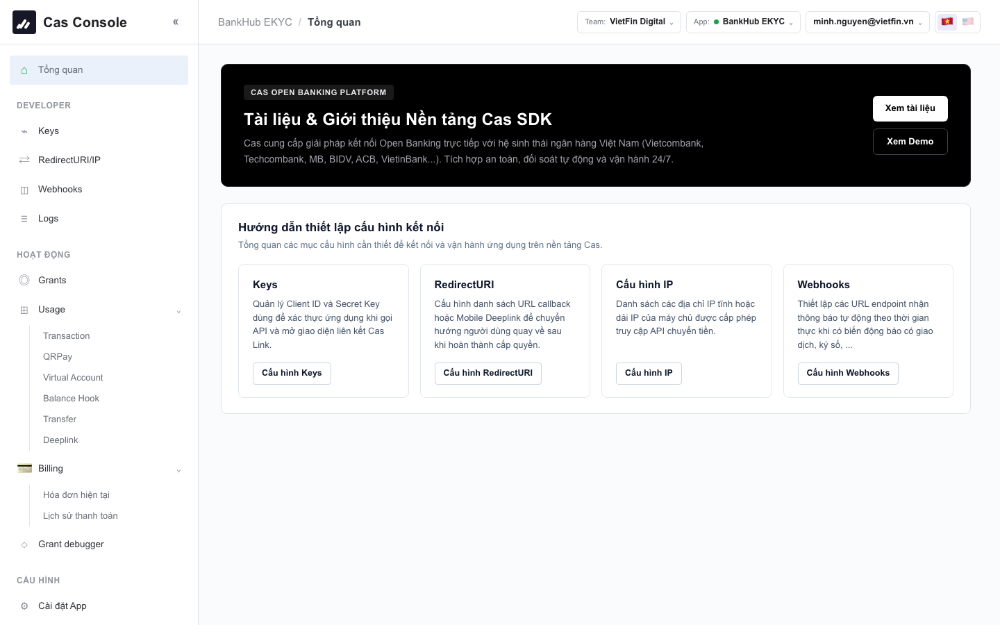

*Hình: Màn hình Tổng quan*

### 2.1. Tài liệu và giới thiệu nền tảng Cas SDK
* **Mục tiêu**: Giới thiệu sơ nét về Cas, cũng như các thông tin cần thiết để Vendor onboard, trải nghiệm và tích hợp cổng Open Banking của Cas.
* **Các liên kết điều hướng**:
  - **Xem tài liệu**: Chuyển tới trang API Documentation (`https://cas.so/intro`).
  - **Xem demo**: Chuyển tới trang trải nghiệm tương tác Sandbox (`https://cas.so/demo`).

### 2.2. Hướng dẫn thiết lập cấu hình (Onboarding Checklist)
* **Mục tiêu**: Hướng dẫn Vendor xem và thiết lập các cấu hình cơ bản trước khi đưa ứng dụng vào vận hành chính thức:
  - **Keys**: Xem cấu hình Client ID và Secret Key.
  - **Redirect URI**: Cấu hình các URL Callback nhận mã xác thực OAuth.
  - **Cấu hình IP**: Đăng ký danh sách IP Whitelist của máy chủ Vendor (bắt buộc khi sử dụng dịch vụ Chuyển tiền / Virtual Account).
  - **Webhook**: Cấu hình URL nhận biến động số dư tức thì cho các dịch vụ Transaction, Sign, Grant, Invoice,...
* **Điều hướng**: Khi click vào nút xem chi tiết tại từng thẻ card, hệ thống sẽ tự động chuyển tới menu cấu hình tương ứng.

---

## 3. DEVELOPER (TRUNG TÂM NHÀ PHÁT TRIỂN)

### 3.1. Keys (Quản lý Khóa API & Secret)

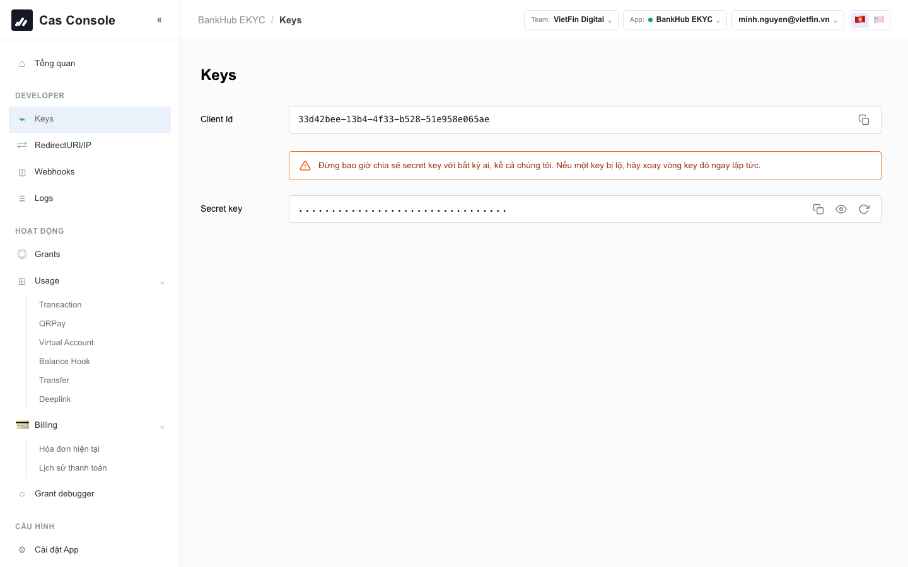

*Hình: Quản lý Keys*

* **Mục tiêu**: Cung cấp thông tin các API Key dùng để định danh và xác thực khi gọi các dịch vụ API của Cas:
  - **Client ID**: Khóa định danh công khai của ứng dụng.
  - **Secret Key**: Khóa bí mật cấp cao dùng để ký chữ ký điện tử và lấy Access Token (mặc định được ẩn bằng ký tự `••••••••` để đảm bảo an toàn).
* **Thao tác**: Sao chép (Copy), Hiển thị/Ẩn (`Reveal/Hide`), Tạo lại khóa (`Regenerate Key`).
* **Lưu ý bảo mật**: Tuyệt đối không chia sẻ `Secret Key` cho bất kỳ ai (kể cả nhân sự hỗ trợ của CAS). Trong trường hợp nghi ngờ bị lộ thông tin, vui lòng nhấn **Tạo lại khóa** ngay lập tức.

---

### 3.2. RedirectURI/IP (Cấu hình Redirect & IP Whitelist)

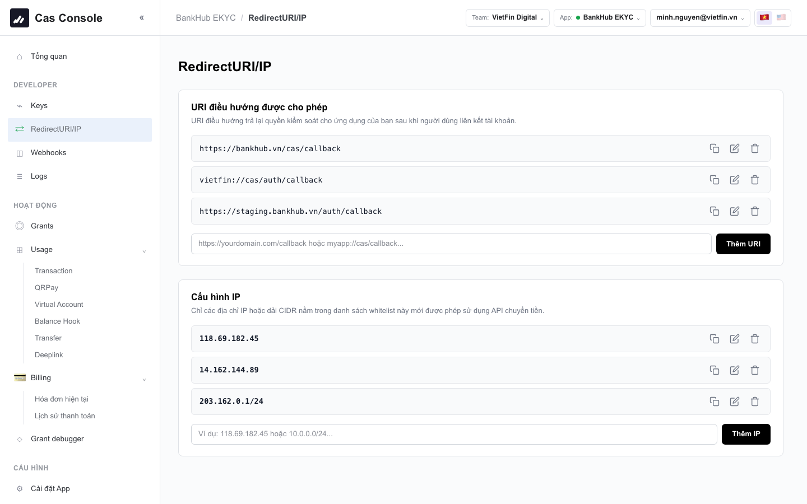

*Hình: Cấu hình Redirect URI và IP Whitelist*

#### 3.2.1. Cấu hình Redirect URI:
* **Mục tiêu**: Quản lý danh sách các URL callback an toàn. Vendor cần đăng ký trước cấu hình tại đây để sử dụng các dịch vụ API có yêu cầu tham số `redirectUri`.
* **Thao tác**: Thêm mới URI, Sao chép, Chỉnh sửa tại chỗ, Xóa.

#### 3.2.2. Cấu hình IP Whitelist:
* **Mục tiêu**: Quản lý danh sách địa chỉ IP / dải mạng CIDR của hệ thống máy chủ Vendor. Bắt buộc phải đăng ký IP trước để được cấp quyền gọi API Chuyển tiền (Transfer API) và Virtual Account.
* **Thao tác**: Thêm mới IP, Sao chép, Chỉnh sửa, Xóa.

---

### 3.3. Webhooks (Quản lý Điểm nhận sự kiện)

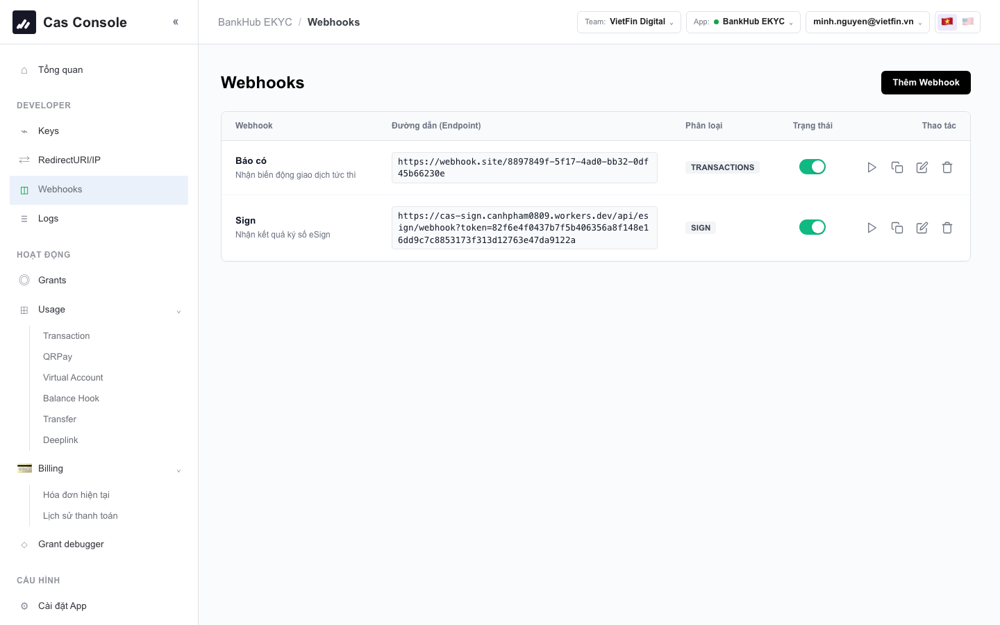

*Hình: Quản lý Webhooks*

* **Mục tiêu**: Cấu hình các Endpoint của Vendor để tiếp nhận thông báo tự động (Push Notification) từ máy chủ CAS khi phát sinh sự kiện tài chính.
* **Các trường dữ liệu hiển thị**:
  1. **Webhook**: Tên gợi nhớ và mô tả chức năng của Webhook.
  2. **Đường dẫn (Endpoint)**: URL lắng nghe giao thức HTTP POST từ Cas Gateway.
  3. **Phân loại**: `TRANSACTIONS`, `GRANT`, `INVOICE`, `AUTO_DEBIT`, `SIGN`.
  4. **Trạng thái**: Nút gạt Bật/Tắt trực quan (`Active` / `Paused`).
* **Thao tác**: Gửi thử nghiệm (`Test Ping HTTP 200`), Sao chép URL, Chỉnh sửa cấu hình và Xóa.
* **Cơ chế kiểm thử an toàn**: Khi thực hiện Lưu Webhook, hệ thống Cas sẽ tự động thực hiện **Test Ping HTTP 200** tới URL của Vendor. Nếu không nhận được phản hồi thành công, hệ thống sẽ cảnh báo không hợp lệ để ngăn ngừa mất mát dữ liệu giao dịch.

*Hình: Modal Thêm mới Webhook*

---

### 3.4. Logs (Nhật ký API & Drawer Chi tiết)

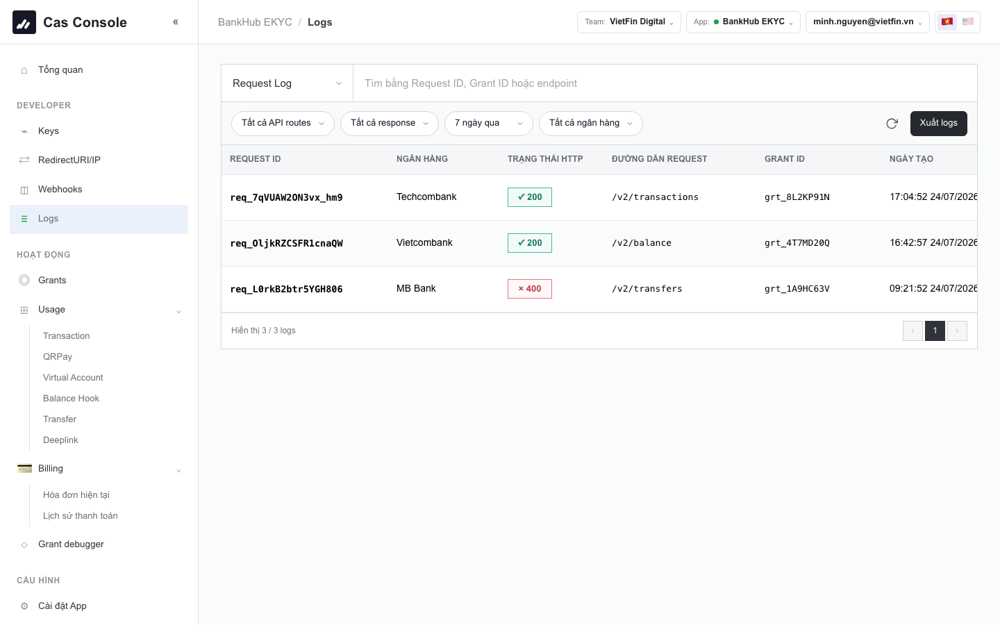

*Hình: Nhật ký Logs*

* **Mục tiêu**: Lưu trữ toàn bộ nhật ký truy vết của tất cả các cuộc gọi API và Webhook phục vụ đối soát, kiểm toán và gỡ lỗi.
* **Danh sách bộ lọc & Tìm kiếm**:
  - **Request Type**: Tất cả, Request (API gửi lên), Webhook (Bắn sự kiện về).
  - **API URL**: Lọc chính xác theo từng Endpoint API.
  - **Kết quả Response**: Lọc theo mã trạng thái HTTP (`200 OK`, `400 Bad Request`, `401 Unauthorized`, `500 Server Error`).
  - **Thời gian**: `24h qua`, `7 ngày qua`, `30 ngày qua`, `Tùy chỉnh` (chọn khoảng ngày bắt đầu - kết thúc).
  - **Ngân hàng**: Lọc theo từng dịch vụ tài chính / Ngân hàng liên kết.
  - **Thao tác**: Làm mới (Refresh), Xuất Log ra file JSON.
* **Drawer xem chi tiết Request**: Khi nhấp vào bất kỳ dòng bản ghi nào, hệ thống mở thanh Drawer bên phải hiển thị toàn bộ payload kỹ thuật:

*Hình: Drawer xem chi tiết Log*

* **Thông tin kỹ thuật trong Drawer bao gồm**:
  - **Trạng thái**: Mã phản hồi HTTP (Ví dụ: `200 OK`, `400 Bad Request`).
  - **Thời gian xử lý**: Độ trễ mili-giây (Ví dụ: `145 ms`).
  - **Thời gian call API**: Ngày giờ chính xác ghi nhận request.
  - **Request**: Phương thức (`GET/POST/PUT/DELETE`) và URL được gọi.
  - **Grant ID**: Mã ủy quyền tài khoản ngân hàng (nếu chưa có hiển thị `null`).
  - **Scope**: Quyền hạn tương ứng của request.
  - **Ngân hàng**: Dịch vụ tài chính được phân quyền.
  - **Request Payload**: Dữ liệu JSON gửi đi.
  - **Response Payload**: Dữ liệu JSON server trả về.
  - **Headers**: Toàn bộ Request Headers truyền vào (được ẩn Secret Key để đảm bảo an toàn).
  - **Mã cURL**: Lệnh cURL mẫu giúp lập trình viên copy và chạy lại trên Terminal.

---

## 4. PHÂN HỆ 3: HOẠT ĐỘNG (OPERATIONS & CHI TIẾT USAGE)

### 4.1. Grants (Quản lý Cấp quyền liên kết ngân hàng)

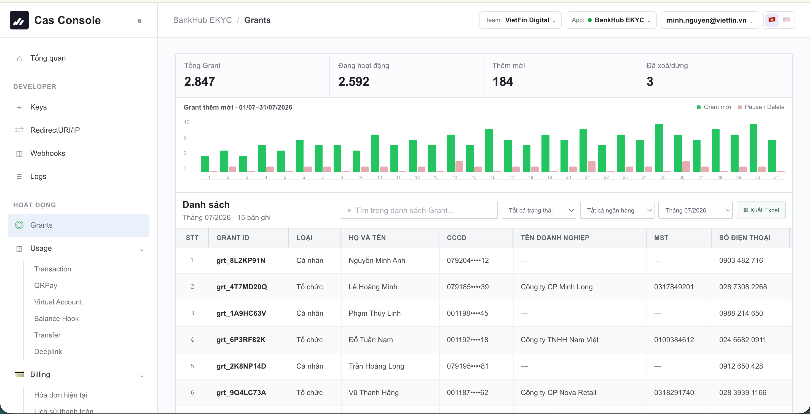

*Hình: Quản lý Grants*

* **Mục tiêu**: Quản lý toàn bộ danh sách phiên cấp quyền ủy quyền tài khoản ngân hàng mà người dùng cuối đã phê duyệt cho ứng dụng của Vendor.
* **Dashboard Thống kê**:
  - **Tổng Grant**: Tổng số lượt Grant đã được cấp quyền cho app.
  - **Đang hoạt động**: Số lượng Grant còn hiệu lực kết nối.
  - **Thêm mới**: Số lượng Grant mới phát sinh (theo bộ lọc 24h, 7 ngày, tháng).
  - **Đã xóa/dừng**: Số lượng Grant đã bị người dùng hủy hoặc tạm ngưng.
  - **Bar Chart**: Biểu đồ trực quan so sánh số lượng Grant thêm mới và đã hủy theo thời gian.
* **Quy cách bảng dữ liệu Grants (13 Cột)**:

| **STT** | **Tên cột** | **Ý nghĩa nghiệp vụ** | **Ví dụ dữ liệu** |
|:---:|---|---|---|
| **1** | **STT** | Số thứ tự bản ghi trên trang hiện tại | `1`, `2`, `3` |
| **2** | **GRANT ID** | Mã định danh phiên ủy quyền duy nhất | `grt_8L2KP91N` |
| **3** | **LOẠI** | Phân loại người dùng: `Cá nhân` hoặc `Tổ chức (Doanh nghiệp)` | `Cá nhân` / `Tổ chức` |
| **4** | **HỌ VÀ TÊN** | Họ và tên cá nhân hoặc người đại diện tổ chức | `Nguyễn Minh Anh` |
| **5** | **CCCD** | Số CCCD của cá nhân hoặc người đại diện | `001200018291` |
| **6** | **TÊN DOANH NGHIỆP** | Tên pháp nhân của tổ chức (nếu là doanh nghiệp) | `CTY TNHH CÔNG NGHỆ MINH ANH` |
| **7** | **MST** | Mã số thuế doanh nghiệp | `0108920192` |
| **8** | **SỐ ĐIỆN THOẠI** | Số điện thoại liên hệ | `0987654321` |
| **9** | **DỊCH VỤ TÀI CHÍNH** | Logo & Tên ngân hàng kết nối | `Techcombank` |
| **10** | **STK** | Số tài khoản thanh toán được ủy quyền | `19036789123011` |
| **11** | **SCOPE** | Danh sách quyền hạn được cấp | `Transaction, Balance, Identity` |
| **12** | **NGÀY TẠO** | Thời điểm khởi tạo phiên cấp quyền | `15/06/2026 09:30:00` |
| **13** | **TRẠNG THÁI** | Trạng thái: `NEW` (Mới), `ACCEPT` (Đã duyệt/Hoạt động), `PAUSE` (Tạm dừng), `DELETED` (Đã hủy) | `ACCEPT` |

* **Các hành động thao tác**:
  - **Tìm kiếm thông minh**: Tìm nhanh theo Grant ID, Họ và Tên, CCCD, MST, STK.
  - **Bộ lọc thời gian**: `24 giờ`, `7 ngày`, `Tháng hiện tại`, `6 tháng gần nhất`.
  - **Bộ lọc Trạng thái**: Tất cả, Đang hoạt động, Tạm dừng, Đã hủy.
  - **Bộ lọc Ngân hàng**: Lọc riêng từng ngân hàng.
  - **Xuất Excel**: Tải danh sách Grant ra file Excel chuẩn.

---

### 4.2. CHI TIẾT SỬ DỤNG DỊCH VỤ (USAGE)

> [!IMPORTANT]
> Dưới đây là đặc tả chi tiết toàn bộ số lượng cột, ý nghĩa nghiệp vụ, dashboard thống kê và các thao tác vận hành của tất cả 6 dịch vụ thành phần trong phân hệ Usage.

---

#### 4.2.1. Dịch vụ TRANSACTION (Sao kê & Lịch sử giao dịch)

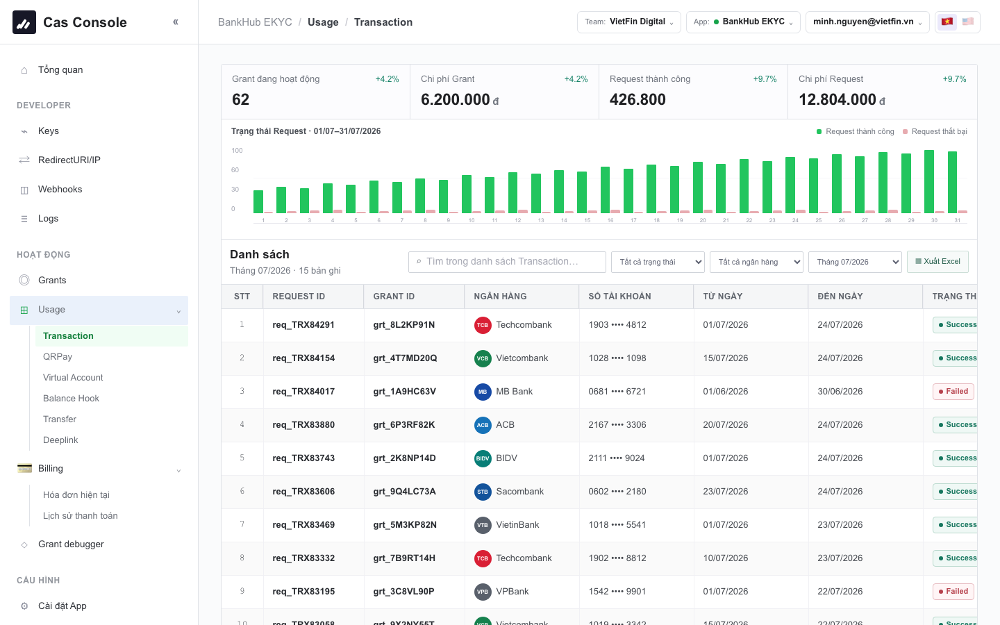

*Hình: Usage - Transaction*

* **Mục tiêu**: Giám sát và truy xuất chi tiết toàn bộ các giao dịch biến động số dư phát sinh trên các tài khoản ngân hàng đã liên kết.
* **Dashboard Thống kê**:
  - **Tổng giao dịch**: Tổng số lượng bản ghi giao dịch ghi nhận trong kỳ.
  - **Báo có (CR)**: Tổng số giao dịch tiền vào tài khoản và tổng giá trị tương ứng.
  - **Báo nợ (DR)**: Tổng số giao dịch tiền ra khỏi tài khoản và tổng giá trị tương ứng.
  - **Tỉ lệ thành công**: Tỷ lệ đồng bộ sao kê chính xác từ cổng ngân hàng.
  - **Bar Chart**: Biểu đồ cột thể hiện khối lượng giao dịch biến động theo từng mốc thời gian.
* **Quy cách bảng dữ liệu (11 Cột)**:

| **STT** | **Tên cột** | **Ý nghĩa nghiệp vụ** | **Ví dụ dữ liệu** |
|:---:|---|---|---|
| **1** | **STT** | Số thứ tự bản ghi trên trang hiện tại | `1`, `2`, `3` |
| **2** | **REQUEST ID** | Mã định danh duy nhất của lượt gọi API đồng bộ sao kê | `req_8K2MP91N` |
| **3** | **GRANT ID** | Mã ủy quyền liên kết tài khoản phát sinh giao dịch | `grt_8L2KP91N` |
| **4** | **KHÁCH HÀNG** | Họ và tên chủ sở hữu tài khoản ngân hàng | `Nguyễn Minh Anh` |
| **5** | **NGÂN HÀNG** | Ngân hàng mở tài khoản giao dịch | `Techcombank` |
| **6** | **SỐ TÀI KHOẢN** | Số tài khoản thanh toán tại ngân hàng | `19036789123011` |
| **7** | **SỐ TIỀN** | Giá trị tiền biến động (+ tiền vào / - tiền ra) | `+₫2,500,000` / `-₫350,000` |
| **8** | **LOẠI GD** | Phân loại hạch toán: Báo có (`CR`) hoặc Báo nợ (`DR`) | `Báo có (CR)` |
| **9** | **NỘI DUNG** | Nội dung chi tiết chuyển khoản / thanh toán từ ngân hàng | `Thanh toan don hang #10928` |
| **10** | **THỜI GIAN** | Thời điểm ghi nhận giao dịch tại hệ thống ngân hàng | `20/08/2026 14:22:10` |
| **11** | **MÃ THAM CHIẾU** | Mã tham chiếu giao dịch (Ref/FT Code) từ sổ cái ngân hàng | `FT2623298104812` |

* **Các hành động thao tác**:
  - **Tìm kiếm**: Tìm nhanh theo Request ID, Grant ID, Khách hàng, STK, Mã tham chiếu FT.
  - **Bộ lọc**: Lọc theo khoảng thời gian (`24h`, `7 ngày`, `Tháng này`, `Tùy chọn`), lọc theo Ngân hàng, lọc theo Loại giao dịch (`Báo có` / `Báo nợ`).
  - **Xuất Excel**: Xuất danh sách giao dịch chi tiết phục vụ đối soát kế toán.

---

#### 4.2.2. Dịch vụ QRPAY (Tạo & Thanh toán mã VietQR)

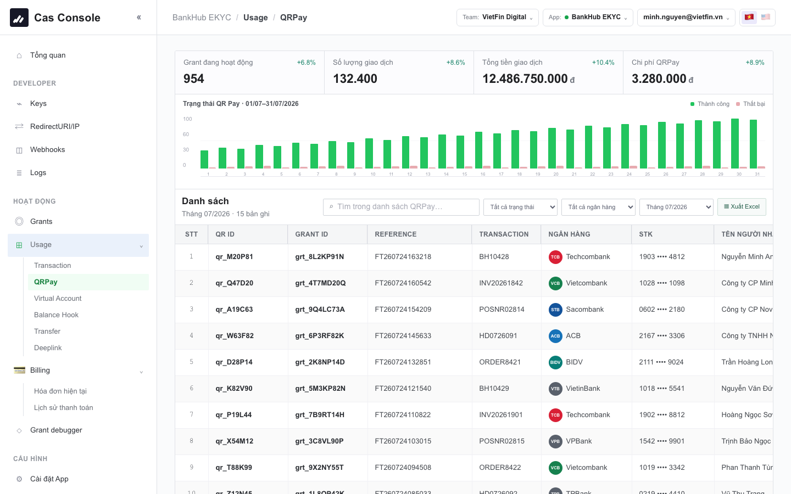

*Hình: Usage - QRPay*

* **Mục tiêu**: Quản lý các đơn hàng thanh toán bằng mã VietQR động chuẩn NAPAS247 được sinh ra tự động từ hệ thống Cas.
* **Dashboard Thống kê**:
  - **Tổng mã QR**: Tổng số lượng mã thanh toán QR đã khởi tạo.
  - **Đã thanh toán (Paid)**: Số lượng mã QR khách hàng đã chuyển khoản thành công.
  - **Đang chờ (Pending)**: Số lượng mã QR đang trong thời gian hiệu lực chờ thanh toán.
  - **Hết hạn (Expired)**: Số lượng mã QR quá thời hạn thanh toán mà chưa nhận được tiền.
  - **Bar Chart**: Biểu đồ theo dõi tỷ lệ thanh toán thành công theo thời gian thực.
* **Quy cách bảng dữ liệu (10 Cột)**:

| **STT** | **Tên cột** | **Ý nghĩa nghiệp vụ** | **Ví dụ dữ liệu** |
|:---:|---|---|---|
| **1** | **STT** | Số thứ tự bản ghi | `1`, `2` |
| **2** | **REQUEST ID** | Mã yêu cầu API tạo mã QR thanh toán | `req_QR77812A` |
| **3** | **GRANT ID** | Mã ủy quyền ứng dụng thụ hưởng | `grt_QR88210M` |
| **4** | **MÃ QR ID** | Mã định danh duy nhất của đơn hàng QR sinh ra | `QR_PAY_8819230` |
| **5** | **NGÂN HÀNG** | Ngân hàng thụ hưởng nhận tiền chuyển qua QR | `Vietcombank` |
| **6** | **SỐ TIỀN** | Số tiền thanh toán gắn liền với mã QR | `₫1,250,000` |
| **7** | **NỘI DUNG** | Cú pháp nội dung chuyển khoản tự động gán vào QR | `CASQR DH88192` |
| **8** | **TRẠNG THÁI** | Trạng thái: `Thành công (Paid)`, `Đang chờ (Pending)`, `Hết hạn (Expired)` | `Thành công` |
| **9** | **THỜI GIAN TẠO** | Thời điểm sinh mã QR | `20/08/2026 10:15:00` |
| **10** | **HẾT HẠN** | Thời hạn hiệu lực tối đa của mã QR | `20/08/2026 10:30:00` |

* **Các hành động thao tác**:
  - **Tìm kiếm**: Tìm theo Request ID, Mã QR ID, Grant ID, Cú pháp nội dung chuyển khoản.
  - **Bộ lọc**: Lọc theo thời gian, lọc theo Trạng thái thanh toán, lọc theo Ngân hàng thụ hưởng.
  - **Xuất Excel**: Tải báo cáo doanh thu thanh toán QR.

---

#### 4.2.3. Dịch vụ VIRTUAL ACCOUNT (Tài khoản ảo định danh - VA)

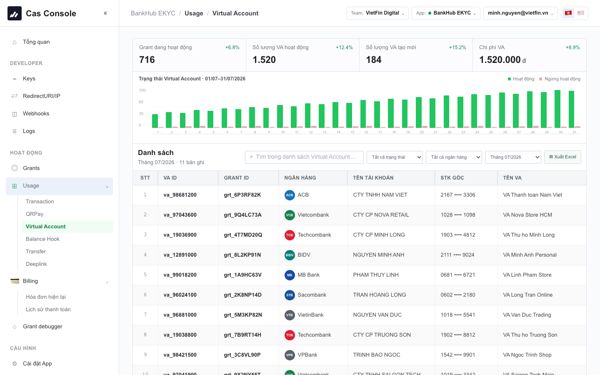

*Hình: Usage - Virtual Account*

* **Mục tiêu**: Cấp phát và quản lý danh sách tài khoản ảo chuyên biệt cho từng khách hàng/đối tác nhằm tự động gạch nợ chính xác 100% khi nhận tiền vào.
* **Dashboard Thống kê**:
  - **Tổng tài khoản VA**: Tổng số tài khoản ảo đã cấp phát trên hệ thống.
  - **Đang hoạt động**: Số lượng tài khoản ảo đang mở và sẵn sàng nhận tiền.
  - **Tạm khóa / Đóng**: Số lượng tài khoản ảo đã hết hạn hoặc tạm ngưng.
  - **Tổng tiền thu hộ**: Tổng lũy kế giá trị tiền đã nạp thành công qua hệ thống VA.
  - **Bar Chart**: Biểu đồ thể hiện dòng tiền nạp vào theo từng chu kỳ.
* **Quy cách bảng dữ liệu (10 Cột chuẩn hóa có VA ID)**:

| **STT** | **Tên cột** | **Ý nghĩa nghiệp vụ** | **Ví dụ dữ liệu** |
|:---:|---|---|---|
| **1** | **STT** | Số thứ tự bản ghi | `1`, `2` |
| **2** | **VA ID** | Mã định danh tài khoản ảo duy nhất trên hệ thống Cas | `VA_99182041` |
| **3** | **GRANT ID** | Mã ủy quyền doanh nghiệp quản lý tài khoản ảo | `grt_VA882910` |
| **4** | **TÊN VA** | Tên định danh gán cho tài khoản ảo (Tên khách hàng / Đại lý) | `CTY TNHH MINH ANH` |
| **5** | **SỐ TK ẢO** | Số tài khoản ảo ngân hàng cấp phát | `9988.1029.3812` |
| **6** | **NGÂN HÀNG** | Ngân hàng đối tác cấp giải pháp tài khoản ảo | `MB Bank` |
| **7** | **SỐ TIỀN NẠP** | Tổng lũy kế số tiền đã thu hộ/nạp qua tài khoản ảo này | `₫45,200,000` |
| **8** | **SỐ DƯ HIỆN TẠI** | Số dư khả dụng hiện còn trong tài khoản ảo | `₫12,400,000` |
| **9** | **TRẠNG THÁI** | `Hoạt động (Active)`, `Tạm khóa (Locked)`, `Đã đóng (Closed)` | `Hoạt động` |
| **10** | **THỜI GIAN TẠO** | Ngày giờ khởi tạo tài khoản ảo | `15/06/2026 09:30:00` |

* **Các hành động thao tác**:
  - **Tìm kiếm**: Tìm theo VA ID, Grant ID, Tên định danh VA, Số tài khoản ảo.
  - **Bộ lọc**: Lọc theo thời gian khởi tạo, Trạng thái hoạt động, Ngân hàng cung cấp.
  - **Xuất Excel**: Tải danh sách và số dư tài khoản ảo ra file Excel.

---

#### 4.2.4. Dịch vụ BALANCE HOOK (Webhook Biến động số dư tức thì)

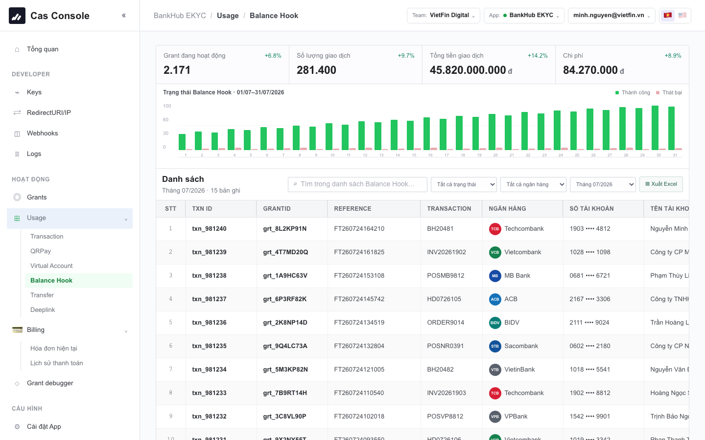

*Hình: Usage - Balance Hook*

* **Mục tiêu**: Giám sát nhật ký bắn sự kiện Webhook thời gian thực (< 1 giây) khi tài khoản ngân hàng nguồn phát sinh biến động thu/chi.
* **Dashboard Thống kê**:
  - **Tổng sự kiện Webhook**: Tổng số bản tin biến động đã phát đi.
  - **Gửi thành công (200 OK)**: Số bản tin máy chủ đối tác tiếp nhận thành công ngay lần đầu.
  - **Đã Retry**: Số bản tin phải kích hoạt cơ chế gửi lại do server đối tác bị nghẽn.
  - **Tỉ lệ thành công**: Tỷ lệ giao vận Webhook thành công (Ví dụ: `99.9%`).
  - **Bar Chart**: Biểu đồ lưu lượng Webhook phát ra theo thời gian.
* **Quy cách bảng dữ liệu (8 Cột)**:

| **STT** | **Tên cột** | **Ý nghĩa nghiệp vụ** | **Ví dụ dữ liệu** |
|:---:|---|---|---|
| **1** | **STT** | Số thứ tự bản ghi | `1`, `2` |
| **2** | **REQUEST ID** | Mã định danh sự kiện webhook biến động số dư | `req_BH881290` |
| **3** | **GRANT ID** | Mã ủy quyền tài khoản ngân hàng phát sinh biến động | `grt_8L2KP91N` |
| **4** | **SỰ KIỆN** | Loại biến động: `balance.credit` (Tiền vào) hoặc `balance.debit` (Tiền ra) | `balance.credit` |
| **5** | **ENDPOINT NHẬN** | URL webhook của máy chủ doanh nghiệp tiếp nhận bản tin | `https://api.domain.vn/hook` |
| **6** | **HTTP STATUS** | Mã phản hồi từ máy chủ doanh nghiệp | `200 OK` / `502 Bad Gateway` |
| **7** | **SỐ LẦN RETRY** | Số lần hệ thống gửi lại nếu phía đối tác bị timeout/lỗi mạng | `0/3` (Thành công ngay) |
| **8** | **THỜI GIAN** | Thời điểm gửi webhook thành công | `20/08/2026 15:30:12` |

* **Các hành động thao tác**:
  - **Tìm kiếm**: Tìm theo Request ID, Grant ID, Endpoint URL nhận tin.
  - **Bộ lọc**: Lọc theo thời gian, lọc theo HTTP Status (`200 OK`, `5xx`, `Timeout`), lọc theo Loại sự kiện.
  - **Xuất Excel**: Tải lịch sử phân phối Webhook.

---

#### 4.2.5. Dịch vụ TRANSFER (Chuyển tiền tự động / Payout API 24/7)

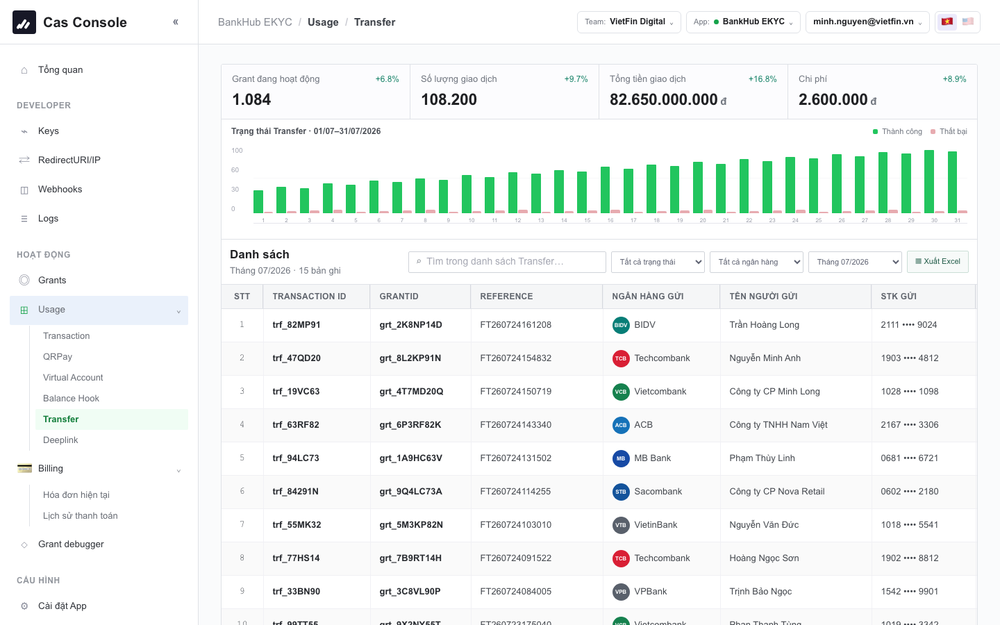

*Hình: Usage - Transfer*

* **Mục tiêu**: Quản lý các lệnh chi hộ tự động, giải ngân, trả thưởng hoặc chi lương liên ngân hàng 24/7 qua cổng NAPAS.
* **Dashboard Thống kê**:
  - **Tổng lệnh chi tiền**: Tổng số giao dịch chuyển khoản đã khởi tạo.
  - **Thành công (Success)**: Số lệnh chuyển tiền hạch toán thành công tại ngân hàng đích.
  - **Đang xử lý (Processing)**: Lệnh đang trong tiến trình xử lý liên ngân hàng.
  - **Thất bại (Failed)**: Lệnh bị từ chối do sai số tài khoản hoặc ngân hàng đích bảo trì.
  - **Tổng giá trị giải ngân**: Tổng số tiền VND đã chuyển khoản thành công trong kỳ.
* **Quy cách bảng dữ liệu (11 Cột)**:

| **STT** | **Tên cột** | **Ý nghĩa nghiệp vụ** | **Ví dụ dữ liệu** |
|:---:|---|---|---|
| **1** | **STT** | Số thứ tự bản ghi | `1`, `2` |
| **2** | **REQUEST ID** | Mã lệnh chi tiền từ hệ thống doanh nghiệp | `req_TR99201F` |
| **3** | **GRANT ID** | Mã ủy quyền tài khoản nguồn trích nợ | `grt_4T7MD20Q` |
| **4** | **NGÂN HÀNG NGUỒN** | Ngân hàng của tài khoản chuyển tiền đi | `Vietcombank` |
| **5** | **NGÂN HÀNG ĐÍCH** | Ngân hàng của tài khoản người nhận tiền | `Techcombank` |
| **6** | **SỐ TK NHẬN** | Số tài khoản thụ hưởng của người nhận | `1902991029301` |
| **7** | **TÊN NGƯỜI NHẬN** | Họ và tên chủ tài khoản thụ hưởng (Tra cứu tự động qua NAPAS) | `Trần Hoàng Long` |
| **8** | **SỐ TIỀN CHUYỂN** | Giá trị tiền thực hiện lệnh chuyển | `₫5,400,000` |
| **9** | **PHÍ GD** | Cước phí chuyển khoản ngân hàng | `₫2,000` |
| **10** | **TRẠNG THÁI** | Trạng thái: `Thành công`, `Đang xử lý`, `Thất bại` | `Thành công` |
| **11** | **MÃ THAM CHIẾU** | Mã giao dịch đối soát của cổng NAPAS247 | `FT262338192031` |

* **Các hành động thao tác**:
  - **Tìm kiếm**: Tìm theo Request ID, Grant ID, Số tài khoản nhận, Tên người nhận, Mã tham chiếu FT.
  - **Bộ lọc**: Lọc theo thời gian, lọc theo Trạng thái chuyển tiền, lọc theo Ngân hàng thụ hưởng.
  - **Xuất Excel**: Tải bảng kê chi tiền chi tiết phục vụ đối soát sổ phụ ngân hàng.

---

#### 4.2.6. Dịch vụ DEEPLINK (Mở App Ngân hàng Thanh toán)

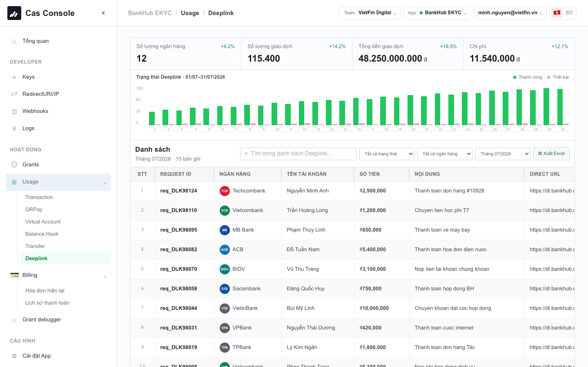

*Hình: Usage - Deeplink*

* **Mục tiêu**: Cung cấp link Universal / App-link tự động chuyển người dùng từ Web/App của Vendor sang thẳng màn hình chuyển tiền trên ứng dụng ngân hàng đã cài đặt sẵn trên điện thoại.
* **Dashboard Thống kê**:
  - **Tổng lượt tạo Deeplink**: Tổng số liên kết thanh toán đã sinh ra.
  - **App mở nhiều nhất**: Thống kê ứng dụng ngân hàng được khách hàng kích hoạt nhiều nhất (Techcombank Mobile, VCB Digibank, MB Bank App,...).
  - **Tỉ lệ chuyển hướng**: Tỷ lệ mở app thành công.
* **Quy cách bảng dữ liệu (7 Cột)**:

| **STT** | **Tên cột** | **Ý nghĩa nghiệp vụ** | **Ví dụ dữ liệu** |
|:---:|---|---|---|
| **1** | **STT** | Số thứ tự bản ghi | `1`, `2` |
| **2** | **REQUEST ID** | Mã định danh yêu cầu tạo link thanh toán | `req_DLK98124` |
| **3** | **NGÂN HÀNG** | Ứng dụng ngân hàng được kích hoạt mở lên | `Techcombank (Techcombank Mobile)` |
| **4** | **TÊN TÀI KHOẢN** | Tên người thụ hưởng đích trên link | `Nguyễn Minh Anh` |
| **5** | **SỐ TIỀN** | Số tiền định tuyến tự động vào màn hình chuyển khoản | `₫2,500,000` |
| **6** | **NỘI DUNG** | Nội dung thanh toán định sẵn | `Thanh toan don hang #10928` |
| **7** | **DIRECT URL** | Đường link Universal/App-link mở app ngân hàng | `https://dl.bankhub.dev/tcb/...` |

* **Các hành động thao tác**:
  - **Tìm kiếm**: Tìm theo Request ID, Tên chủ tài khoản, Nội dung thanh toán.
  - **Bộ lọc**: Lọc theo thời gian, lọc theo Ngân hàng mục tiêu.
  - **Thao tác nhanh**: Sao chép Direct URL để gắn vào nút thanh toán trên ứng dụng của Vendor, Xuất Excel.

---

### 4.3. BILLING (HÓA ĐƠN & LỊCH SỬ THANH TOÁN)

#### 4.3.1. Hóa đơn hiện tại

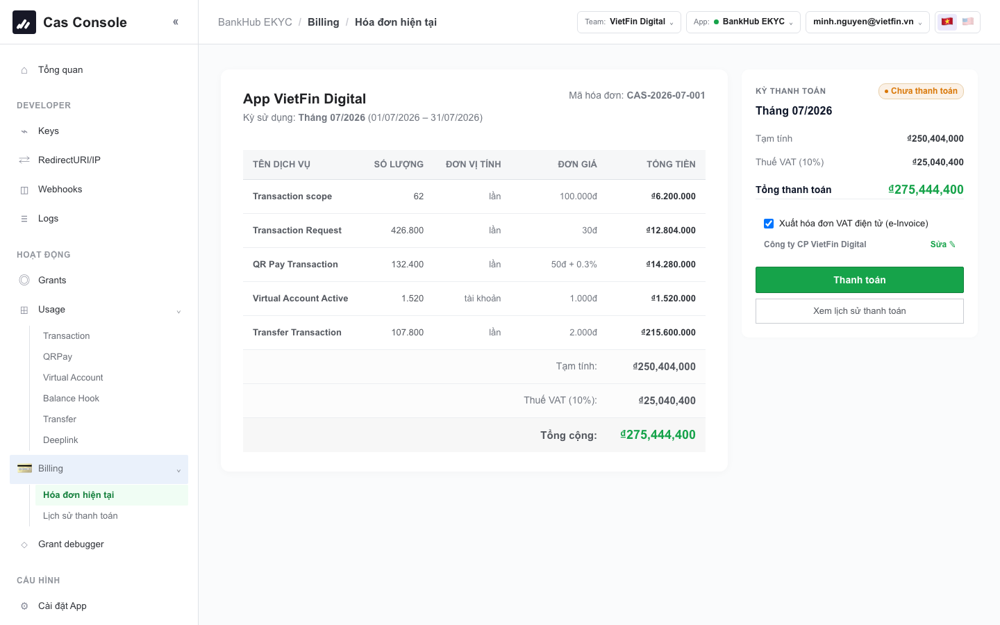

*Hình: Billing - Hóa đơn hiện tại*

* **Mục tiêu**: Cho phép Vendor theo dõi cước phí sử dụng thực tế phát sinh trong chu kỳ tháng hiện tại theo cơ chế thời gian thực.
* **Thành phần chức năng**:
  - **Thông tin chu kỳ**: Hiển thị tháng cước hiện hành (Ví dụ: `Tháng 08/2026`) và hạn thanh toán.
  - **Tổng tiền thanh toán**: Số tiền cước tạm tính đã bao gồm thuế GTGT (VAT 10%).
  - **Thanh toán ngay**: Quét mã VietQR thanh toán tự động hạch toán cước tức thì.
  - **Cấu hình Xuất hóa đơn điện tử (VAT e-Invoice)**: Nút bật/tắt xuất hóa đơn VAT kèm modal cập nhật thông tin *Tên công ty*, *Mã số thuế*, *Địa chỉ trụ sở* và *Email nhận hóa đơn*.

---

#### 4.3.2. Lịch sử thanh toán & Chi tiết hóa đơn chu kỳ chuẩn hóa 5 dịch vụ

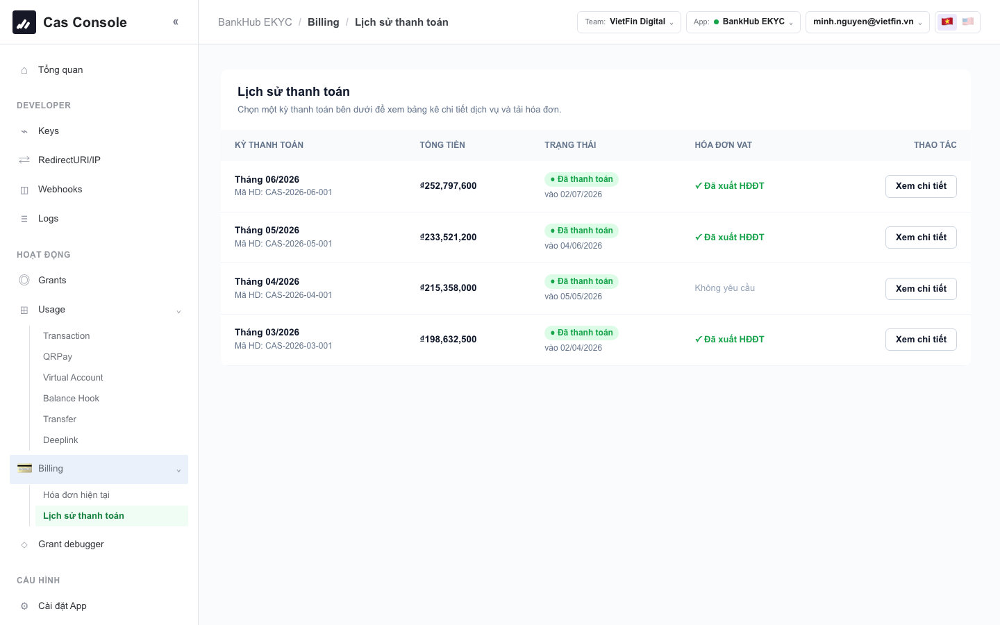

*Hình: Billing - Lịch sử thanh toán*

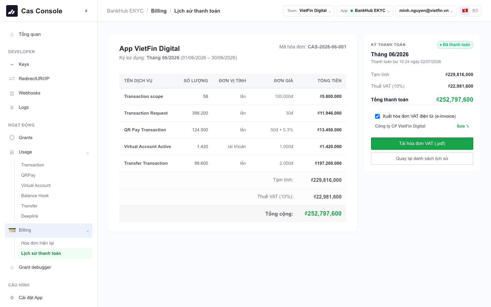

*Hình: Chi tiết chu kỳ cước*

* **Mục tiêu**: Lưu trữ hồ sơ các kỳ cước quá khứ (`Tháng 06/2026`, `Tháng 05/2026`, `Tháng 04/2026`, `Tháng 03/2026`) phục vụ công tác kế toán và lưu trữ chứng từ.
* **Quy chuẩn 5 Dịch vụ tính cước chuẩn hóa**:

| **STT** | **Tên dịch vụ** | **Số lượng tiêu dùng** | **Đơn vị tính** | **Đơn giá chuẩn** | **Thành tiền (VND)** |
|:---:|---|:---:|:---:|:---:|:---:|
| **1** | **Transaction scope** *(Ủy quyền kết nối sao kê)* | `62` | `lần` | `100.000đ / lần` | `₫6.200.000` |
| **2** | **Transaction Request** *(Truy vấn giao dịch API)* | `426.800` | `lần` | `30đ / lần` | `₫12.804.000` |
| **3** | **QR Pay Transaction** *(Thanh toán VietQR)* | `132.400` | `lần` | `50đ + 0.3% / lần` | `₫14.280.000` |
| **4** | **Virtual Account Active** *(Duy trì tài khoản ảo VA)* | `1.520` | `tài khoản` | `1.000đ / tài khoản` | `₫1.520.000` |
| **5** | **Transfer Transaction** *(Lệnh chuyển tiền Payout)* | `107.800` | `lần` | `2.000đ / lần` | `₫215.600.000` |
| | **TỔNG TIỀN DỊCH VỤ** | | | | **₫250.404.000** |
| | **THUẾ GTGT (VAT 10%)** | | | | **₫25.040.400** |
| | **TỔNG CỘNG THANH TOÁN** | | | | **₫275.444.400** |

* **Thao tác chứng từ**: Tải hóa đơn điện tử hợp lệ (`.pdf`) và Tải bảng kê chi tiết dịch vụ (`.xlsx`).

---

### 4.4. Grant Debugger (Công cụ Kiểm thử & Gỡ lỗi)

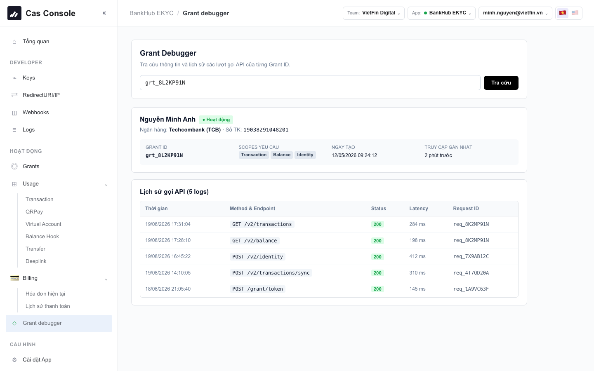

*Hình: Grant Debugger*

* **Mục tiêu**: Công cụ hỗ trợ đội ngũ kỹ thuật của Vendor và đội ngũ hỗ trợ kỹ thuật Cas kiểm tra tính sống còn và gỡ lỗi kết nối trên từng Grant ID.
* **Chức năng chính**:
  - **Tra cứu Token**: Kiểm tra trạng thái Token còn hiệu lực hay đã hết hạn.
  - **Gọi API Giả lập**: Mô phỏng luồng gọi API lấy thông tin tài khoản, sao kê hoặc kiểm tra số dư.
  - **Phân tích mã lỗi ngân hàng**: Tra cứu nguyên nhân lỗi trả về từ phía ngân hàng (Ví dụ: `INVALID_OTP`, `SESSION_TIMEOUT`, `ACCOUNT_LOCKED`).

---

## 5. PHÂN HỆ 4: CẤU HÌNH & QUẢN TRỊ TỔ CHỨC (TEAM & APP MANAGEMENT)

### 5.1. Cài đặt App (App Settings)

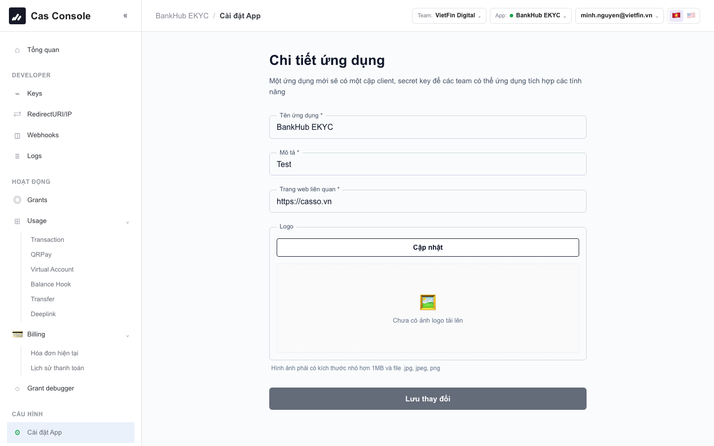

*Hình: Cài đặt App*

* **Mục tiêu**: Quản lý thông tin cấu hình của ứng dụng đang làm việc.
* **Các trường thông tin**:
  - **Tên Ứng dụng**: Đổi tên hiển thị của ứng dụng.
  - **Môi trường**: Chuyển đổi giữa `Sandbox (Thử nghiệm)` và `Production (Môi trường thật)`.
  - **App ID**: Mã định danh duy nhất của ứng dụng.
  - **Webhook mặc định**: Thiết lập URL nhận thông báo chung cho toàn bộ app.

---

### 5.2. Thiết lập Team (Tổng quan & Danh sách Thành viên)

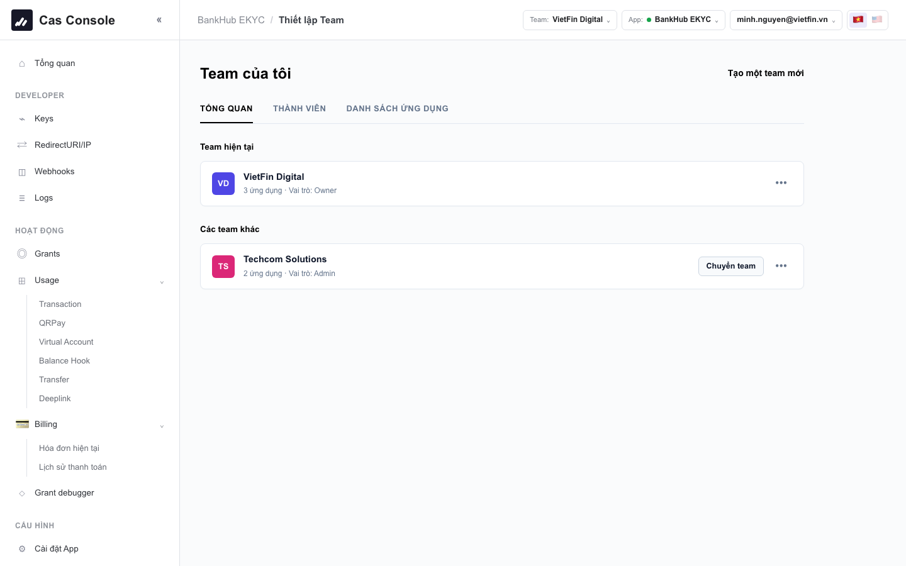

*Hình: Thiết lập Team - Tổng quan*

*Hình: Thiết lập Team - Thành viên*

* **Mục tiêu**: Quản lý không gian làm việc của tổ chức (Team Workspace) và phân bổ nhân sự.
* **Chức năng chi tiết**:
  - **Tab Tổng quan**: Xem thông tin Team hiện tại, danh sách các Team trực thuộc, chuyển đổi qua lại giữa các Team và nút **Tạo một team mới**.
  - **Tab Thành viên**: Danh sách nhân sự trong Team kèm vai trò (`Owner`, `Admin`, `Developer`, `Viewer`), ngày tham gia và trạng thái hoạt động.

---

### 5.3. Mời Thành viên Mới & Ma trận Phân quyền (RBAC)

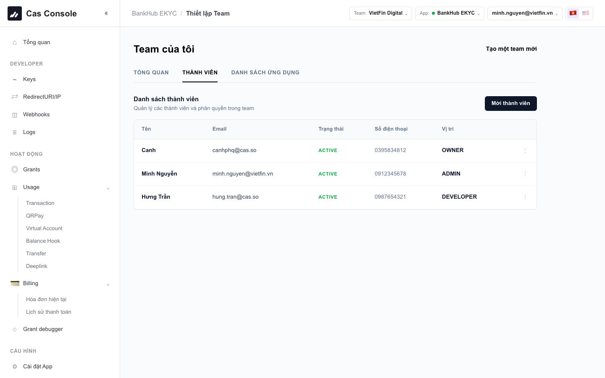

*Hình: Mời thành viên mới*

* **Quy trình mời thành viên**:
  1. Nhập địa chỉ Email của nhân sự cần mời vào hệ thống.
  2. Lựa chọn 1 trong 4 vai trò quản trị phân cấp:
     - **Chủ sở hữu (Owner)**: Toàn quyền quản trị tài chính, xóa team, đổi tên và quản lý phân quyền.
     - **Quản trị viên (Admin)**: Toàn quyền cấu hình kỹ thuật, mời thành viên, xem và thanh toán hóa đơn.
     - **Nhà phát triển (Developer)**: Xem và thao tác trên Keys, Webhooks, Redirect URI, Logs và Usage (không có quyền xem Billing & Team).
     - **Người xem (Viewer)**: Chỉ xem dữ liệu thống kê báo cáo (bị ẩn Secret Key và không thể chỉnh sửa cấu hình).
  3. Bảng ma trận phân quyền bên dưới tự động cập nhật danh mục quyền hạn tương ứng để người mời kiểm tra trước khi phát lệnh mời.

---

### 5.4. Tạo Team Mới & Tạo Ứng Dụng Mới

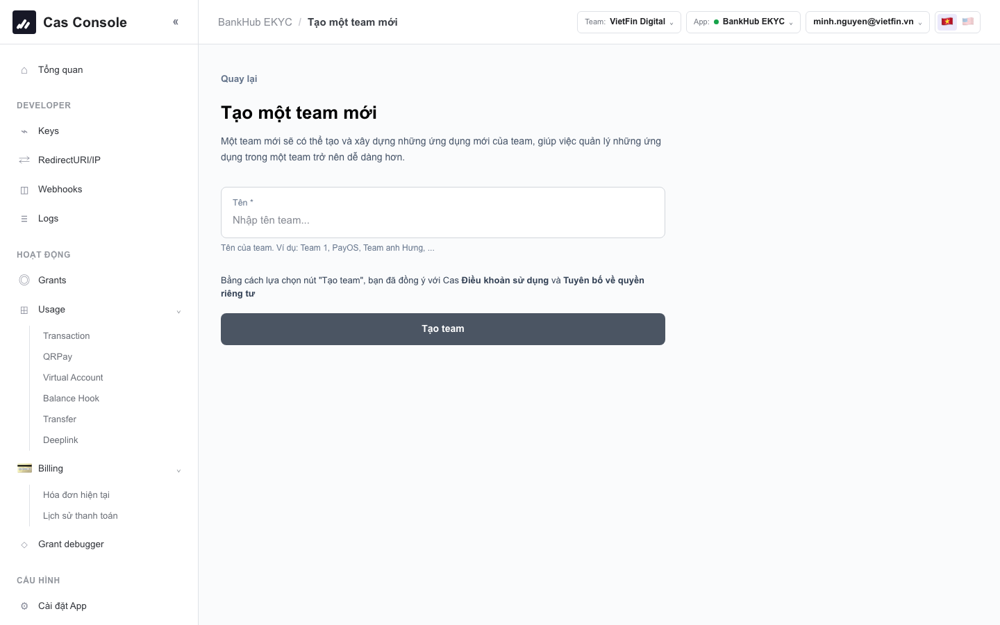

*Hình: Tạo Team mới*

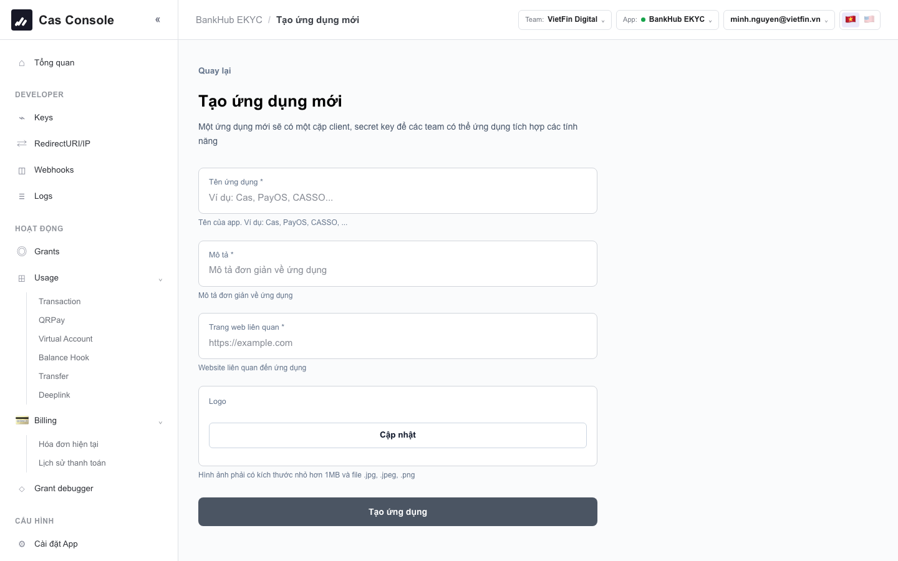

*Hình: Tạo Ứng dụng mới*

* **Tạo Team mới**: Khởi tạo một tổ chức / không gian làm việc mới độc lập trên hệ thống Cas với Tên team và Mã định danh riêng biệt.
* **Tạo Ứng dụng mới**: Thêm ứng dụng mới vào Team chủ quản, lựa chọn môi trường hoạt động (*Production* hoặc *Sandbox*), chọn màu nhận diện và thiết lập phân quyền ban đầu.

---

## 6. KẾT LUẬN

Tài liệu BRD phiên bản **3.0.0** là chuẩn mực kỹ thuật và nghiệp vụ chính thức cho toàn bộ hệ thống **Cas Console**. Toàn bộ cấu trúc giao diện, luồng vận hành, bảng dữ liệu chi tiết của 6 dịch vụ Usage, module Billing 5 nhóm dịch vụ chuẩn hóa và quy trình quản trị Team/App đã được đồng bộ 100% với phiên bản ứng dụng thực tế đang chạy.
